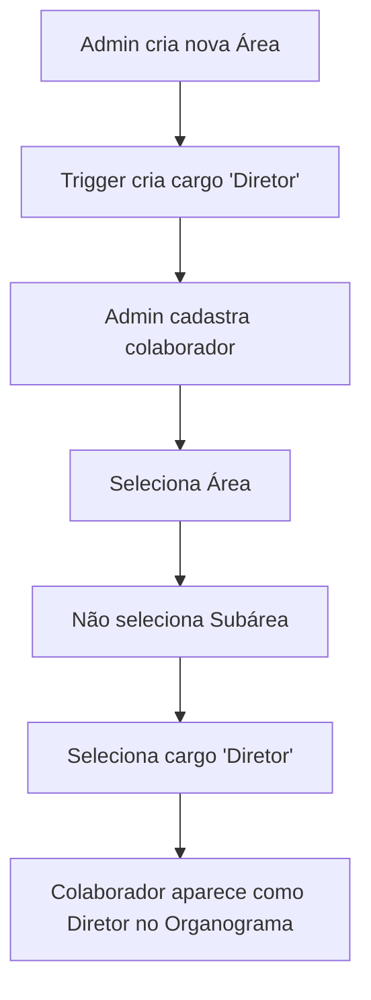

# Plano: Cargo de Diretor Automático por Área

## Objetivo

Cada área deve ter automaticamente um cargo "Diretor" no topo da hierarquia, permitindo que:
1. Colaboradores sejam cadastrados como diretores sem precisar selecionar subárea
2. No organograma, o diretor apareça acima de todas as subáreas

## Análise do Estado Atual

### Já Implementado ✅
- Schema: `positions.area_id` (nullable) e `subarea_id` (nullable)
- UI em Áreas e Cargos: botão "+" para adicionar cargo na área
- Filtro de posições por área quando subárea não é selecionada
- Organograma mostra posições de área acima das subáreas

### Precisa Mudar ❌
1. **Criação automática do cargo "Diretor"** quando uma área é criada
2. **Formulário de colaborador**: mostrar cargos de área quando apenas área é selecionada
3. **UI/UX**: indicar claramente que o cargo "Diretor" é especial

---

## Mudanças Necessárias

### 1. Database Migration: Auto-create Director Position

**Arquivo**: `supabase/migrations/20260304185000_auto_create_director.sql`

```sql
-- Function to auto-create director position when area is created
CREATE OR REPLACE FUNCTION create_director_position()
RETURNS TRIGGER AS $$
BEGIN
  INSERT INTO positions (title, area_id, subarea_id, tenant_id, level, sort_order)
  VALUES ('Diretor', NEW.id, NULL, NEW.tenant_id, 1, 0);
  RETURN NEW;
END;
$$ LANGUAGE plpgsql;

-- Trigger on company_areas table
CREATE TRIGGER trigger_create_director
AFTER INSERT ON company_areas
FOR EACH ROW
EXECUTE FUNCTION create_director_position();

-- Create director positions for existing areas
INSERT INTO positions (title, area_id, subarea_id, tenant_id, level, sort_order)
SELECT 'Diretor', a.id, NULL, a.tenant_id, 1, 0
FROM company_areas a
WHERE NOT EXISTS (
  SELECT 1 FROM positions p 
  WHERE p.area_id = a.id 
  AND p.title = 'Diretor'
);
```

### 2. Atualizar Formulário de Colaborador

**Arquivo**: `src/pages/Colaboradores.tsx`

**Mudança**: Quando o usuário seleciona apenas a área (sem subárea), mostrar os cargos de área (Diretor).

```typescript
// Linha ~968: Atualizar filtro de posições
const filteredPositions = allPositions?.filter((p) => {
  if (selectedSubareaId) return p.subarea_id === selectedSubareaId;
  if (selectedAreaType) {
    const area = areas?.find((a) => a.type === selectedAreaType);
    return area ? p.area_id === area.id : false;
  }
  return true;
}) || [];
```

**Já está implementado!** O código já filtra corretamente.

### 3. Melhorar UX: Indicar cargo de Diretor

**Arquivo**: `src/pages/Colaboradores.tsx`

Adicionar indicador visual quando o cargo é de nível de área:

```typescript
// No Select de cargos, mostrar badge "Diretoria" para cargos de área
<SelectContent>
  {filteredPositions.map((p) => (
    <SelectItem key={p.id} value={p.id}>
      {p.title}
      {!p.subarea_id && p.area_id && <span className="text-xs text-muted-foreground ml-1">(Diretor)</span>}
    </SelectItem>
  ))}
</SelectContent>
```

### 4. Atualizar Label no Organograma

**Arquivo**: `src/pages/Organograma.tsx` e `src/components/shared/EmployeeDetailModal.tsx`

**Já implementado!** O código já mostra apenas o nome da área quando `subarea_name === "Diretoria"`.

---

## Fluxo de Uso



## Checklist de Implementação

- [ ] Criar migration com trigger para auto-criar "Diretor"
- [ ] Executar migration no Supabase
- [ ] Testar criação de nova área
- [ ] Testar cadastro de colaborador como diretor
- [ ] Verificar organograma

## Notas

- O cargo "Diretor" pode ser renomeado depois em "Áreas e Cargos"
- Se precisar de múltiplos diretores por área, pode criar manualmente
- O trigger só cria na criação da área, não afeta áreas existentes (script separado)