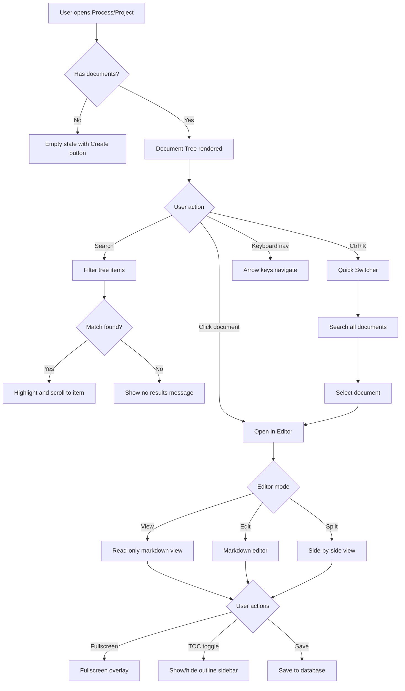

# Document UX Improvements & Vercel Deployment Plan

## Overview

This plan addresses three main objectives:
1. Fix the document tree index issues in processes
2. Improve document viewing/editing UX with fullscreen mode and better navigation
3. Prepare the project for Vercel deployment

---

## Part 1: Document Tree Index Improvements

### Current Issues in [`ProcessDocTree.tsx`](src/components/processes/ProcessDocTree.tsx)

1. **Visual Hierarchy**: Depth is only shown through indentation (16px per level), which is hard to see at deeper levels
2. **No Search/Filter**: Users cannot quickly find documents in large trees
3. **No Keyboard Navigation**: Arrow keys, Enter, and Escape don't work for tree navigation
4. **Limited Visual Feedback**: Selected/active states could be more prominent
5. **No Collapse All/Expand All**: Users must manually toggle each folder

### Proposed Improvements

#### 1.1 Enhanced Visual Hierarchy
```
- Add vertical connector lines between items
- Add folder icons that change based on state (open/closed)
- Add file type icons based on document content
- Improve indentation with visible tree lines
```

#### 1.2 Search & Quick Filter
```
- Add search input at top of tree
- Filter documents/folders as user types
- Highlight matching text in results
- Add "recent documents" quick access
```

#### 1.3 Keyboard Navigation
```
- Arrow Up/Down: Navigate between items
- Arrow Right: Expand folder or move to first child
- Arrow Left: Collapse folder or move to parent
- Enter: Select/open document
- Escape: Clear selection or close search
- Ctrl/Cmd + K: Open quick switcher
```

#### 1.4 Document Quick Switcher
```
- Command palette-style overlay (Ctrl/Cmd + K)
- Search across all documents
- Show recent documents
- Keyboard-navigable results
```

---

## Part 2: Document Editor UX Improvements

### Current Issues in [`ProcessDocEditor.tsx`](src/components/processes/ProcessDocEditor.tsx)

1. **No Fullscreen Mode**: Documents are constrained to the panel size
2. **No Split View**: Cannot see edit and preview simultaneously
3. **Limited Toolbar**: Basic markdown buttons only
4. **No Document Outline**: No TOC sidebar for long documents
5. **No Zoom/Font Size Controls**: Cannot adjust reading size

### Proposed Improvements

#### 2.1 Fullscreen Mode
```
Features:
- Expand button in toolbar (Maximize2 icon)
- Fullscreen overlay with document content
- ESC key to exit
- Retain edit/view mode state
- Full toolbar available in fullscreen
```

#### 2.2 Split View (Edit + Preview)
```
- Toggle button in toolbar
- Side-by-side layout when active
- Synchronized scrolling
- Real-time preview updates
```

#### 2.3 Enhanced Toolbar
```
- View mode toggle (View/Edit/Split)
- Fullscreen button
- Font size controls (zoom in/out/reset)
- Table of Contents toggle
- Word/character count
- Last saved timestamp
```

#### 2.4 Document Outline Sidebar
```
- Extract headings from markdown
- Clickable TOC items
- Highlight current section while scrolling
- Collapsible in fullscreen mode
```

#### 2.5 Reading Experience
```
- Adjustable font size
- Wide/narrow layout toggle
- Focus mode (dim surrounding content)
- Reading progress indicator
```

---

## Part 3: Vercel Deployment Preparation

### Current Project Structure
- Vite + React + TypeScript
- Uses `import.meta.env` for environment variables
- SPA with client-side routing via React Router

### Required Changes

#### 3.1 Create `vercel.json`
```json
{
  "rewrites": [
    { "source": "/(.*)", "destination": "/index.html" }
  ],
  "headers": [
    {
      "source": "/assets/(.*)",
      "headers": [
        { "key": "Cache-Control", "value": "public, max-age=31536000, immutable" }
      ]
    }
  ]
}
```

#### 3.2 Environment Variables
The following variables must be configured in Vercel dashboard:

| Variable | Description |
|----------|-------------|
| `VITE_SUPABASE_URL` | Supabase project URL |
| `VITE_SUPABASE_PUBLISHABLE_KEY` | Supabase anon/public key |

#### 3.3 Build Settings
```
Framework Preset: Vite
Build Command: npm run build
Output Directory: dist
Install Command: npm install
```

#### 3.4 Optional: Preview Deployments
- Each PR gets a preview URL
- Branch previews for testing

---

## Implementation Order

### Phase 1: Critical Fixes (Document Tree)
1. [ ] Fix tree visual hierarchy with connector lines
2. [ ] Add search/filter functionality
3. [ ] Implement keyboard navigation
4. [ ] Add quick switcher (Ctrl+K)

### Phase 2: Editor Improvements
1. [ ] Add fullscreen mode to ProcessDocEditor
2. [ ] Add split view (edit + preview)
3. [ ] Add document outline sidebar
4. [ ] Add font size/zoom controls
5. [ ] Add word count and save status

### Phase 3: Vercel Deployment
1. [ ] Create vercel.json configuration
2. [ ] Test production build locally
3. [ ] Configure environment variables in Vercel
4. [ ] Deploy and test

---

## Technical Details

### Files to Modify

| File | Changes |
|------|---------|
| `src/components/processes/ProcessDocTree.tsx` | Search, keyboard nav, visual improvements |
| `src/components/processes/ProcessDocEditor.tsx` | Fullscreen, split view, toolbar |
| `src/components/shared/MarkdownViewer.tsx` | Already has TOC support, may need enhancements |
| `vercel.json` | New file for SPA routing |
| `package.json` | Verify build scripts |

### New Components to Create

| Component | Purpose |
|-----------|---------|
| `DocumentQuickSwitcher.tsx` | Command palette for quick document access |
| `DocumentOutline.tsx` | Standalone TOC sidebar component |
| `FullscreenViewer.tsx` | Fullscreen document overlay |

### Dependencies
No new dependencies required. All features can be implemented with existing:
- `@radix-ui/react-dialog` (for fullscreen overlay)
- `lucide-react` (icons)
- Existing UI components

---

## Mermaid Diagram: Document Navigation Flow



---

## Questions for Clarification

1. **Document Tree Scope**: Should the improvements apply to both `ProcessDocTree` (used in Projects) and any process-specific document views?

2. **Fullscreen Default**: Should fullscreen mode remember user preference (persist to localStorage)?

3. **Mobile Support**: Should keyboard shortcuts and fullscreen work on mobile devices?

4. **Collaboration**: Any plans for real-time collaboration? (Would affect editor architecture)

5. **Vercel Team**: Should this be deployed to a personal account or team project?
